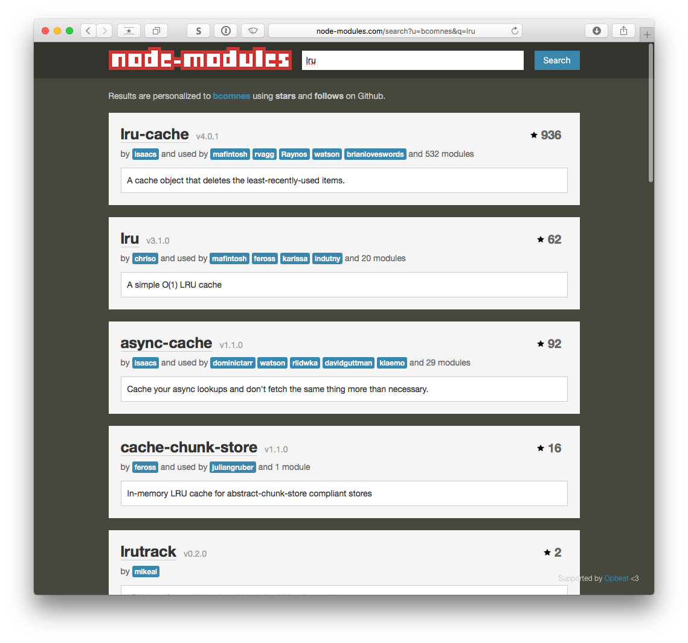

# Challenge 2

## Problem Statement

Imagine your company has created a service which can translate small snippets of text (say, up to 140 characters long) from one language to another (e.g., from English to Danish). The translation is computationally expensive, and your backend systems are having difficulty keeping up with the growing popularity of the service.

To reduce load on the backend systems, you are tasked with designing a cache to store commonly-translated snippets.

Describe how your caching system would handle the following operations (for example, what algorithms/data structures would you use, and why):

* a) Locate the translation of a given snippet, if it is present in the cache
* b) Determine which snippet should be removed from the cache to make room for new translations. This should be the snippet which has been in the cache for the longest time without having had a 'hit'

## Solution Discussion and Examples

>There are only two hard things in Computer Science: cache invalidation and naming things.
>
>-- Phil Karlton

Luckily, this problem has a well known solution that can be applied relatively easily to most severs and services.  

The type of cache system we are likely looking for here is called a [Last Recently Updated](https://en.wikipedia.org/wiki/Cache_replacement_policies#LRU) Cache replacement policy (a.k.a. LRU Cache).  

A LRU Cache works like a key value store or hash table.   Its size is limited by how many key/values it can store.  When the cache has the requested key, it allow us to skip the costly query and return the value from the cache.  When the cache is missing a requested key, the query is run, its key and value is added to the cache, and if the cache is fully hydrated, the key in the cache that has been used the least recently is discarded.

### Abstract Solution Requirements

#### a) How will this LRU Cache locate a translation for a given snippet if in a cache?

The key/value data structure that LRU should use needs to have the same lookup cost properties that an [Associative Array](https://en.wikipedia.org/wiki/Associative_array) would provide.  In Javascript, depending on the needs of the cache, a simple [object](https://developer.mozilla.org/en-US/docs/Web/JavaScript/Reference/Global_Objects/Object) could be used.  You could also potentially use some kind of external key value store like [leveldb](https://github.com/Level/levelup), however the performance implications of that would have to be taken into consideration.  You could also use a specific data structure (such as a [hash table](https://en.wikipedia.org/wiki/Hash_table)) which has the correct performance implications that best matches the characteristics of the system you are trying to cache.

#### b) Determine which snippet should be removed from the cache to make room for new translations.

We can use some kind of ordered list that lets us quickly move recently accessed cache hits to the front of the list, updating its freshness, and ejecting the least recently accessed key (least fresh) when adding new keys to a full cache.  An obvious data structure that would provide us with the desired characteristics would be a [linked list](https://en.wikipedia.org/wiki/Linked_list) because it allows for efficient array index swapping and easy tail ejection.  In JS, we can simply us the built-in [array](https://developer.mozilla.org/en-US/docs/Web/JavaScript/Reference/Global_Objects/Array).

### Solution 1: Pseudo code

Here is a naive implementation of an LRU cache.  You could use this in in front of where you would make an expensive call to an API or computation.

```js

function LRU (size, opts) {
  if (!(this instanceof LRU)) return new LRU(size)
  if (!size) size = 10
  if (!opts) opts = {}

  this.size = size
  // We use an associative array because javascript provides these by default,
  // and they help us keep track of order.
  this._accessList = []
  // We use an object as a hash table for our key/value pairs to provide even
  // lookup time for all keys
  this._hashTable = {}
}

LRU.prototype.get = function (key) {
  if (this._hashTable.hasOwnProperty(key)) {
    this._moveToFront(key)
    return this._hashTable[key]
  } else {
    return undefined
  }
}

LRU.prototype._moveToFront = function (key) {
  const keyIndex = this._accessList.indexOf(key)
  if (keyIndex >= 0) {
    this._accessList.splice(keyIndex, 1)
  }
  this._accessList.unshift(key)
}

LRU.prototype.set = function (key, value) {
  this._hashTable[key] = value
  this._accessList.unshift(key)
  if (this._accessList.length > this.size) {
    delete this._hashTable[this._accessList.pop()]
  }
}

module.exports = LRU

```

Here is some Pseudo code that demonstrates this being used in front of an expensive call:

```js
const LRU = require('LRU')
const lru = new LRU(30 /* size */)

function translateAPI(snippet, snippetLanguage, translateLanguage) {
  // process snippet and opts for validity so they are key safe
  // Here is a possible and hypothetical key schema
  const key = [snippet, snippetLanguage, translateLanguage].join('!!!')
  const cacheValue = lru.get(key) // Successful lookup reorders backing lookup array and returns value
  if (cacheValue) {
    return cacheValue
  } else { // missing lru lookup results in an add operation after expensive run
    const translation = expensiveCall(snippet, snippetLanguage, translateLanguage)
    lru.set(key, translation) // new key / value gets added to the lru kv store.
    // lru internally adds the new key to the front of the access array
    // if the access array is full during the set operation, the last key in the access array
    // gets removed, and that key is used to prune a value from the lru key value store
    return translation
  }
}
```

The devil is in the details, as you don't have control of the underlying data structures in JS primitives.  If you need a more robust API, or the performance of the above implementation doesn't cut it, you will have to look into some kind of more performant data structure or underlying implementation.

To test out the above code run:

```
npm i
npm start

bret-mbr:challenge-2 bret$ npm start

> challenge-2@1.0.0 start /Users/bret/repos/challenge-bcomnes/challenge-2
> node index.js

BEEP
LRU {
  size: 3,
  _accessList: [ 'beep' ],
  _hashTable: { beep: 'BEEP' } }
elapsed: 1022
-------------------
BOOP
LRU {
  size: 3,
  _accessList: [ 'boop', 'beep' ],
  _hashTable: { beep: 'BEEP', boop: 'BOOP' } }
elapsed: 2023
-------------------
WHATEVER
LRU {
  size: 3,
  _accessList: [ 'whatever', 'boop', 'beep' ],
  _hashTable: { beep: 'BEEP', boop: 'BOOP', whatever: 'WHATEVER' } }
elapsed: 3027
-------------------
WHATEVER
LRU {
  size: 3,
  _accessList: [ 'whatever', 'boop', 'beep' ],
  _hashTable: { beep: 'BEEP', boop: 'BOOP', whatever: 'WHATEVER' } }
elapsed: 3028
-------------------
BOOP
LRU {
  size: 3,
  _accessList: [ 'boop', 'whatever', 'beep' ],
  _hashTable: { beep: 'BEEP', boop: 'BOOP', whatever: 'WHATEVER' } }
elapsed: 3028
-------------------
BEEP
LRU {
  size: 3,
  _accessList: [ 'beep', 'boop', 'whatever' ],
  _hashTable: { beep: 'BEEP', boop: 'BOOP', whatever: 'WHATEVER' } }
elapsed: 3029
-------------------
BLOP
LRU {
  size: 3,
  _accessList: [ 'blop', 'beep', 'boop' ],
  _hashTable: { beep: 'BEEP', boop: 'BOOP', blop: 'BLOP' } }
elapsed: 4032
-------------------
Done!
[ 'BEEP', 'BOOP', 'WHATEVER', 'WHATEVER', 'BOOP', 'BEEP', 'BLOP' ]

```


### Solution 2: Use a Module

LRU cacheing is a well traveled path, so we would likely benefit from recycling the work of others.  Our first step would be to look for prior work.  Let's take a quick peek at what our friends have created and depend on:

[node-modules.com/search?u=bcomnes&q=lru](http://node-modules.com/search?u=bcomnes&q=lru)



There are three excellent looking choices available to us:

- [isaacs/node-lru-cache](https://github.com/isaacs/node-lru-cache)
- [isaacs/async-cache](https://github.com/isaacs/async-cache)
- [adzerk/node-lru-native](https://github.com/adzerk/node-lru-native)

They are essentially the same module, except one offers a sync API, while the other can wrap an async key/value lookup function.  The third offers some kind of C++ binding which might let the cache [go faster](http://i0.kym-cdn.com/photos/images/newsfeed/000/506/223/2ab.gif).  These modules look appealing for a number of reasons:  

- Open Source and permissively licensed.  
- Lots of smart trustworthy developers seem to have used it in the past.  
- Many existing modules depend on it.  The chances of community maintenance is high.
- At least a few years of steady development has hopefully solidified the API, working out all the details and issues involved in a simple LRU cache.
- Offers more flexibility and settings than our simple solution.  Caching is a performance optimization, and optimization tuning should go hand in hand with profiling.  This gives us more knobs to turn.

### Other Considerations

- We could use a proxy such as Nginx or HAProxy in front of a fleet of translation workers to distribute the load across multiple machines.  
- The cache could live in front of every worker, or each worker could have its own cache.  
- Strategies such as query sharding by language could also be tuned to possibly improve cache hit probability.
- Perhaps there is some kind of cheap natural language processing that could help generate more fine grained keys based on phrases.  Natural language processing is a domain that is totally out of my experience however.  For general LRU caches, you could use something like [Rabin Fingerprinting](https://en.wikipedia.org/wiki/Rabin_fingerprint) to generate sets of cache keys that overlap with similar queries, possibly increasing the useful lifetime of a cache item.
